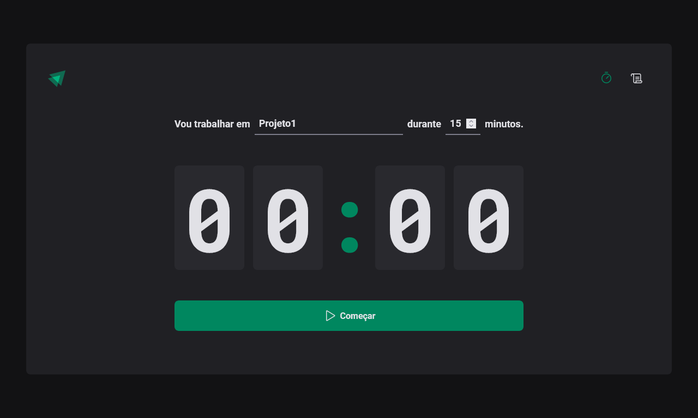

<h1 align="center">
  <image src="https://ignite-timer-gules-two.vercel.app/assets/logo.6585cbe4.svg"/> Ignite Timer
</h1>

 

  

## 🚀 Tecnologias

Tecnologias utilizadas no projeto:

- ReactJS
- Vite
- Typescript
- Styled Components
- Phosphor React
- Date-fns
- immer
- React router
- React Toastify
- React Hook Form
- ZOD

 

## 💻 Projeto

O Ignite Timer é uma aplicação que possui um temporizador, nele podemos escrever ou seleciona algum projeto já salvo que iremos focar e a duração de tempo, possui também um histórico para saber quanto tempo foi dedicado a  um projeto.

 

## ⚒️ Features

- [x] Temporizador
- [x] Histórico

 

## 🔖 Layout

Layout da aplicação no [figma](https://www.figma.com/community/file/1127351821076435124/Ignite-Timer).

 

## 🌐 Deploy

Você pode ver o site clicando <a href="https://ignite-timer-gules-two.vercel.app/" target="_blank">nesse link</a>.

 

## :memo: Licença

Esse projeto está sob a licença MIT. Veja o arquivo <a href="https://github.com/Gabriel-Sousa/ignite-timer/blob/main/.github/LICENSE" target="_blank">LICENSE</a>  para mais detalhes.

---

Feito com ♥ por Gabriel Sousa
